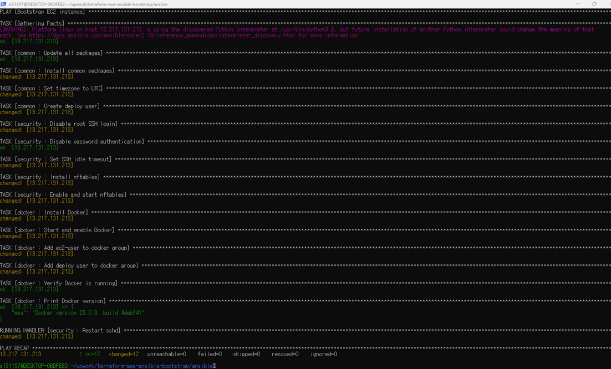
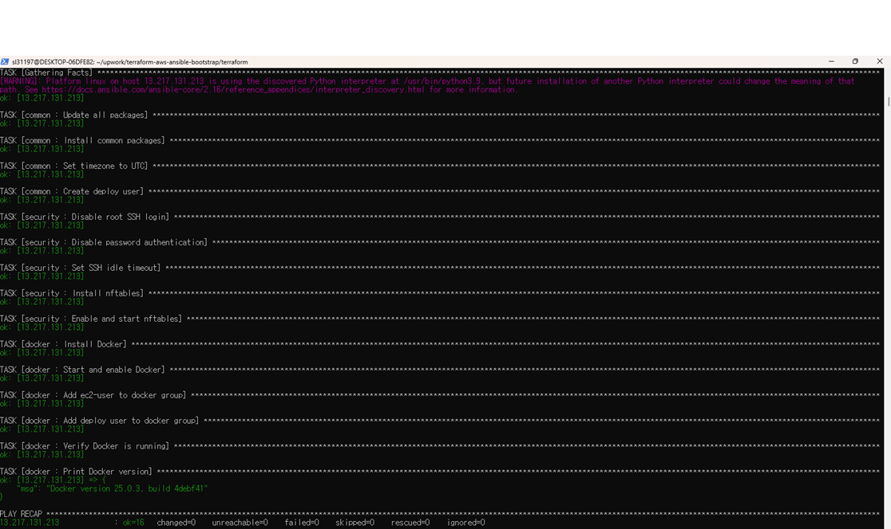
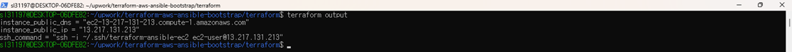

# Production-Style AWS Provisioning Framework

[](https://github.com/wndudkr2024/terraform-aws-ansible-bootstrap/actions/workflows/ci.yml)

Production-style infrastructure provisioning framework using Terraform and Ansible on AWS.

This project demonstrates end-to-end server provisioning: from VPC creation to a fully configured, hardened, and Docker-ready EC2 instance.

---

## What This Does

1. **Terraform** provisions a complete AWS network and compute layer
2. **Ansible** configures the server to a production-ready state
3. **GitHub Actions** validates code quality on every push

---

## Architecture

Terraform

↓

VPC (10.0.0.0/16)

├── Public Subnet (10.0.1.0/24)

├── Internet Gateway

├── Route Table

├── Security Group

└── EC2 Instance (Amazon Linux 2023)

↓

Ansible

├── common role  → packages, timezone, deploy user

├── security role → SSH hardening, nftables

└── docker role  → Docker installation and configuration
---

## Stack

- **Terraform** >= 1.5.0
- **AWS Provider** ~> 6.0
- **Ansible** with ansible-lint production profile
- **Amazon Linux 2023**
- **Docker** 25.x
- **GitHub Actions** CI

---

## Infrastructure (Terraform)

| Resource | Details |
|---|---|
| VPC | 10.0.0.0/16, DNS enabled |
| Public Subnet | 10.0.1.0/24 |
| Internet Gateway | Attached to VPC |
| Route Table | 0.0.0.0/0 via IGW |
| Security Group | SSH (22) inbound |
| EC2 | t3.micro, Amazon Linux 2023 |

---

## Ansible Roles

### common
- System package update
- Essential package installation
- Timezone configuration (UTC)
- Deploy user creation with sudo access

### security
- Root SSH login disabled
- Password authentication disabled
- SSH idle timeout (300s)
- nftables enabled

### docker
- Docker installation and service enablement
- ec2-user and deploy user added to docker group
- Docker version verification

---

## Usage

### 1. Provision Infrastructure

```bash
cd terraform/
terraform init
terraform plan
terraform apply
```

### 2. Update Ansible Inventory

```ini
[bootstrap]
<EC2_PUBLIC_IP>

[bootstrap:vars]
ansible_user=ec2-user
ansible_ssh_private_key_file=~/.ssh/your-key
ansible_ssh_common_args='-o StrictHostKeyChecking=no'
```

### 3. Run Ansible

```bash
cd ansible/
ansible -i inventory.ini all -m ping
ansible-playbook -i inventory.ini site.yml
```

### 4. Destroy Infrastructure

```bash
cd terraform/
terraform destroy
```

---

## Code Quality

```bash
yamllint ansible/
ansible-lint ansible/site.yml
```

ansible-lint passes at **production** profile — the highest validation level.

---

## Design Principles

- **Idempotent** — safe to run multiple times
- **Modular** — each role has a single responsibility
- **Validated** — yamllint and ansible-lint on every commit
- **Production-style** — FQCN modules, handlers, proper variable structure

---

## Disclaimer

This project demonstrates production patterns used in enterprise environments.

---

## Screenshots

### Ansible Playbook Execution



### Idempotent Execution (changed=0)



### Terraform Output


